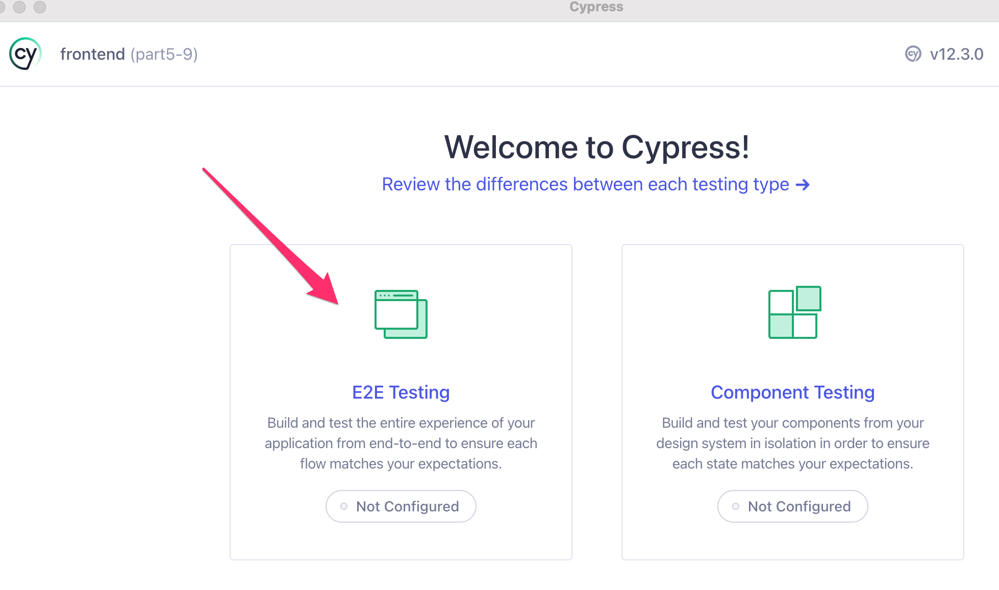
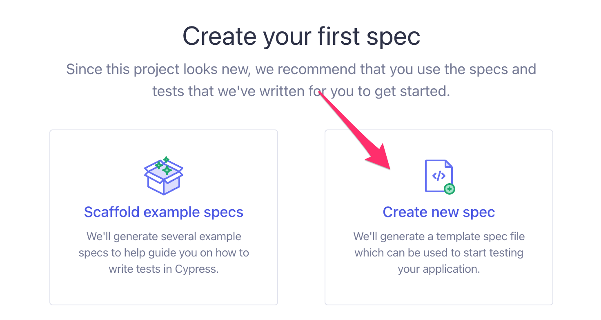
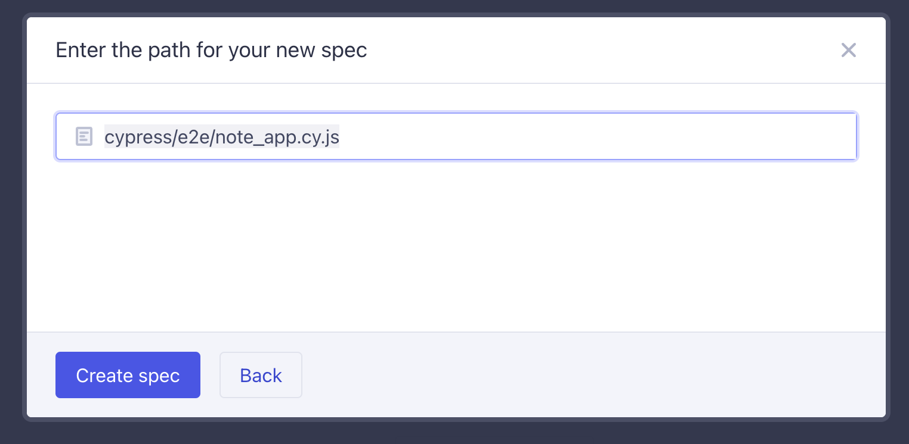
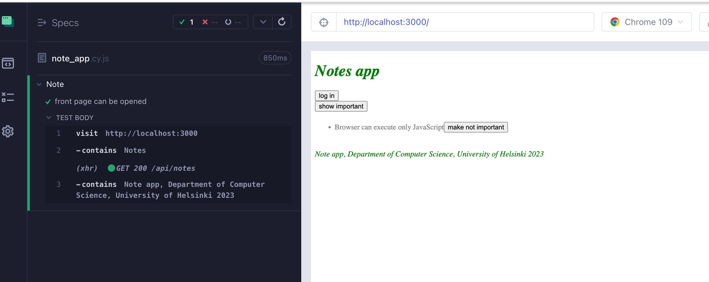
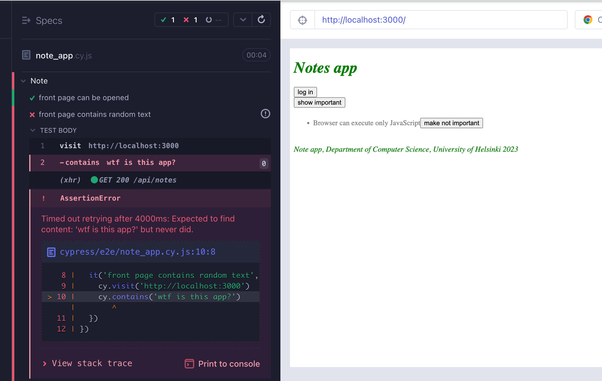
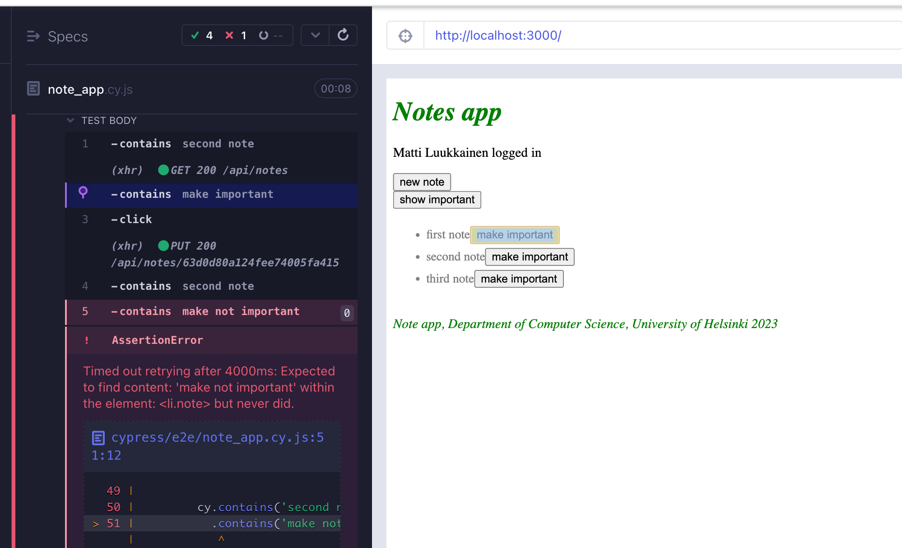
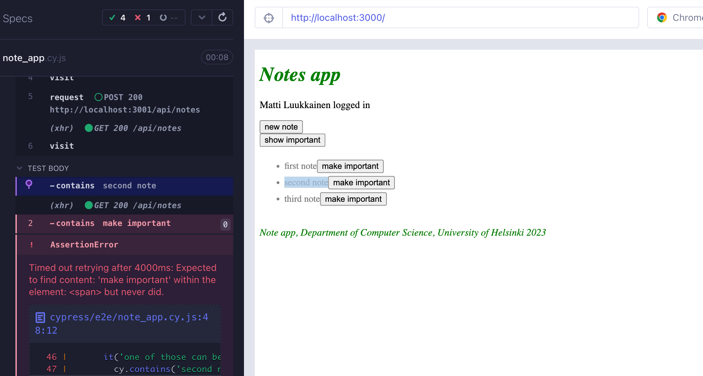
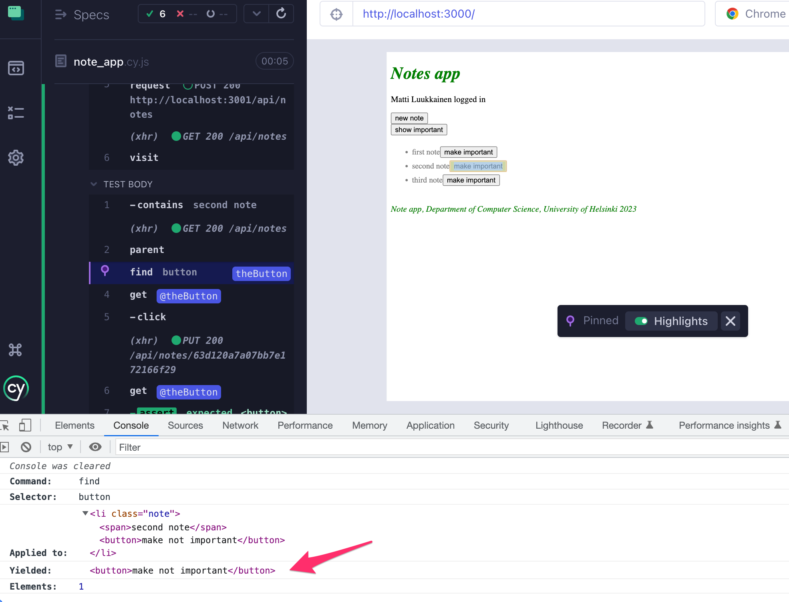

<div class="content">

Hasta ahora, hemos probado el backend como un todo a nivel de API usando pruebas de integración, y probado algunos componentes frontend usando pruebas unitarias.

A continuación, veremos una forma de probar el [sistema como un todo](https://en.wikipedia.org/wiki/System_testing) usando pruebas de <i>Extremo a Extremo</i> (End to End o E2E).

Podemos hacer pruebas E2E de una aplicación web usando un navegador y una librería de pruebas. Hay varias librerías disponibles, por ejemplo [Selenium](http://www.seleniumhq.org/) que se puede utilizar con casi cualquier navegador.
Otra opción de navegador son los denominados [headless browsers](https://es.wikipedia.org/wiki/Navegador_sin_interfaz_gr%C3%A1fica) (navegadores sin cabeza), que son navegadores sin interfaz gráfica de usuario.
Por ejemplo, Chrome se puede utilizar en modo sin cabeza.

Las pruebas E2E son potencialmente la categoría de pruebas más útil, porque prueban el sistema a través de la misma interfaz que usan los usuarios reales.

También tienen algunos inconvenientes. Configurar las pruebas E2E es más complicado que las pruebas unitarias o de integración. También tienden a ser bastante lentas y, con un sistema grande, su tiempo de ejecución puede ser de minutos, incluso horas. Esto es malo para el desarrollo, porque durante el desarrollo es beneficioso poder ejecutar pruebas con la mayor frecuencia posible en caso de sufrir [regresiones](https://es.wikipedia.org/wiki/Pruebas_de_regresi%C3%B3n) de código.

Las pruebas E2E también pueden ser [flaky](https://hackernoon.com/flaky-tests-a-war-that-never-ends-9aa32fdef359) (inestables).
Algunas pruebas pueden pasar una vez y fallar en otra, incluso si el código no cambia en absoluto.

### Cypress

La biblioteca E2E [Cypress](https://www.cypress.io/) se ha vuelto popular durante los últimos años. Cypress es excepcionalmente fácil de usar y, en comparación con Selenium, por ejemplo, requiere mucha menos molestia y dolor de cabeza.
Su principio operativo es radicalmente diferente al de la mayoría de las librerías de prueba E2E, porque las pruebas Cypress se ejecutan completamente dentro del navegador.
Otras librerías ejecutan las pruebas en un proceso de Node, que está conectado al navegador a través de una API.

Hagamos algunas pruebas de extremo a extremo para nuestra aplicación de notas.

Comenzamos instalando Cypress en el <i>frontend </i> como dependencia de desarrollo

```js
npm install --save-dev cypress
```

y agregando un script npm para ejecutarlo:

```js
{
  // ...
  "scripts": {
    "dev": "vite --host",  // highlight-line
    "build": "vite build",
    "lint": "eslint . --ext js,jsx --report-unused-disable-directives --max-warnings 0",
    "preview": "vite preview",
    "server": "json-server -p3001 --watch db.json",
    "test": "jest",
    "cypress:open": "cypress open"  // highlight-line
  },
  // ...
}
```

También le hacemos un pequeño cambio al script que inicia la aplicación, sin este cambio Cypress no puede acceder a ella.

A diferencia de las pruebas unitarias del frontend, las pruebas de Cypress pueden estar en el repositorio frontend o backend, o incluso en su propio repositorio separado.

Las pruebas requieren que el sistema bajo prueba esté funcionando. A diferencia de nuestras pruebas de integración de backend, las pruebas de Cypress <i>no inician</i> el sistema cuando se ejecutan.

Agreguemos un script npm al <i>backend </i> que lo inicia en modo de prueba, o para que <i>NODE\\_ENV </i> sea <i>test</i>.

```js
{
  // ...
  "scripts": {
    "start": "NODE_ENV=production node index.js",
    "dev": "NODE_ENV=development nodemon index.js",
    "build:ui": "rm -rf build && cd ../frontend/ && npm run build && cp -r build ../backend",
    "deploy": "fly deploy",
    "deploy:full": "npm run build:ui && npm run deploy",
    "logs:prod": "fly logs",
    "lint": "eslint .",
    "test": "jest --verbose --runInBand",
    "start:test": "NODE_ENV=test node index.js" // highlight-line
  },
  // ...
}
```

**NB** Para conseguir que Cypress funcione con WSL2 se debe realizar una configuración preliminar. Estos dos [enlaces](https://docs.cypress.io/guides/references/advanced-installation#Windows-Subsystem-for-Linux) son buenos lugares para [iniciar](https://nickymeuleman.netlify.app/blog/gui-on-wsl2-cypress).

Cuando tanto el backend como el frontend están ejecutándose, podemos iniciar Cypress con el comando

```js
npm run cypress:open
```

Cypress nos pregunta qué tipo de prueba realizaremos. Debemos elegir "E2E Testing":



A continuación debemos elegir un navegador (por ejemplo Chrome) y luego debemos hacer click en "Create new spec":



Creemos el archivo de prueba <i>cypress/e2e/note\_app.cy.js</i>:



Podemos editar la prueba en Cypress, pero usemos en cambio VS Code:


Ahora podemos cerrar la vista de edición de Cypress.

Cambiemos el contenido de la prueba como se muestra a continuación:

```js
describe('Note app', function() {
  it('front page can be opened', function() {
    cy.visit('http://localhost:5173')
    cy.contains('Notes')
    cy.contains('Note app, Department of Computer Science, University of Helsinki 2023')
  })
})
```

La prueba se ejecuta haciendo clic en ella en Cypress:

Ejecutar la prueba muestra cómo se comporta la aplicación mientras esta se ejecuta:



La estructura de la prueba debería resultar familiar. Utilizan bloques <i>describe</i> para agrupar diferentes casos de prueba, al igual que Jest. Los casos de prueba se han definido con el método <i>it</i>. Cypress tomó estas partes de la librería de pruebas [Mocha](https://mochajs.org/) a la que utiliza bajo el capó.

[cy.visit](https://docs.cypress.io/api/commands/visit.html) y [cy.contains](https://docs.cypress.io/api/commands/contains.html) son comandos de Cypress, y su propósito es bastante obvio.
[cy.visit](https://docs.cypress.io/api/commands/visit.html) abre la dirección web dada como parámetro en el navegador utilizado por la prueba. [cy.contains](https://docs.cypress.io/api/commands/contains.html) busca la cadena que recibió como parámetro en la página.

Podríamos haber declarado la prueba usando una función de flecha

```js
describe('Note app', () => { // highlight-line
  it('front page can be opened', () => { // highlight-line
    cy.visit('http://localhost:5173')
    cy.contains('Notes')
    cy.contains('Note app, Department of Computer Science, University of Helsinki 2023')
  })
})
```

Sin embargo, Mocha [recomienda](https://mochajs.org/#arrow-functions) que no se utilicen funciones de flecha, porque podrían causar algunos problemas en ciertas situaciones.

Si <i>cy.contains</i> no encuentra el texto que está buscando, la prueba no pasa. Por lo tanto, si extendemos nuestra prueba de la siguiente manera

```js
describe('Note app', function() {
  it('front page can be opened',  function() {
    cy.visit('http://localhost:5173')
    cy.contains('Notes')
    cy.contains('Note app, Department of Computer Science, University of Helsinki 2023')
  })

// highlight-start
  it('front page contains random text', function() {
    cy.visit('http://localhost:5173')
    cy.contains('wtf is this app?')
  })
// highlight-end
})
```

la prueba falla



Eliminemos el código que falla de la prueba.

La variable _cy_ que utilizan nuestras pruebas nos da un error Eslint molesto


Podemos deshacernos de él instalando [eslint-plugin-cypress](https://github.com/cypress-io/eslint-plugin-cypress) como una dependencia de desarrollo

```js
npm install eslint-plugin-cypress --save-dev
```

y cambiando la configuración en <i>.eslintrc.cjs</i> de la siguiente manera:

```js
module.exports = {
  "env": {
    browser: true,
    es2020: true,
    "jest/globals": true,
    "cypress/globals": true // highlight-line
  },
  "extends": [ 
    // ...
  ],
  "parserOptions": {
    // ...
  },
  "plugins": [
      "react", "jest", "cypress" // highlight-line
  ],
  "rules": {
    // ...
  }
}
```

### Escribiendo en un formulario

Extendamos nuestras pruebas para que nuestra nueva prueba intente iniciar sesión en nuestra aplicación.
Suponemos que nuestro backend contiene un usuario con el nombre de usuario <i>mluukkai</i> y la contraseña <i>salainen</i>.

La prueba comienza abriendo el formulario de inicio de sesión.

```js
describe('Note app',  function() {
  // ...

  it('login form can be opened', function() {
    cy.visit('http://localhost:5173')
    cy.contains('log in').click()
  })
})
```

La prueba primero busca el botón de inicio de sesión por su texto y hace clic en el botón con el comando [cy.click](https://docs.cypress.io/api/commands/click.html#Syntax).

Nuestras dos pruebas comienzan de la misma manera, abriendo la página <i>http://localhost:5173</i>, por lo que deberíamos extraer el código compartido en un bloque <i>beforeEach</i> que se ejecuta antes de cada prueba:

```js
describe('Note app', function() {
  // highlight-start
  beforeEach(function() {
    cy.visit('http://localhost:5173')
  })
  // highlight-end

  it('front page can be opened', function() {
    cy.contains('Notes')
    cy.contains('Note app, Department of Computer Science, University of Helsinki 2023')
  })

  it('login form can be opened', function() {
    cy.contains('log in').click()
  })
})
```

El campo de inicio de sesión contiene dos campos de <i>input</i>, en los que la prueba debe escribir.

El comando [cy.get](https://docs.cypress.io/api/commands/get.html#Syntax) permite buscar elementos mediante selectores CSS.

Podemos acceda al primer y último campo de input de la página, y escribir en ellos con el comando [cy.type](https://docs.cypress.io/api/commands/type.html#Syntax) así:

```js
it('user can login', function () {
  cy.contains('log in').click()
  cy.get('input:first').type('mluukkai')
  cy.get('input:last').type('salainen')
})  
```

La prueba funciona. El problema es que si luego agregamos más campos de input, la prueba se interrumpirá porque espera que los campos que necesita sean el primero y el último en la página.

Sería mejor dar a nuestros inputs <i>IDs</i> únicos y usarlos para encontrarlos.
Cambiamos nuestro formulario de inicio de sesión de la siguiente manera:

```js
const LoginForm = ({ ... }) => {
  return (
    <div>
      <h2>Login</h2>
      <form onSubmit={handleSubmit}>
        <div>
          username
          <input
            id='username'  // highlight-line
            value={username}
            onChange={handleUsernameChange}
          />
        </div>
        <div>
          password
          <input
            id='password' // highlight-line
            type="password"
            value={password}
            onChange={handlePasswordChange}
          />
        </div>
        <button id="login-button" type="submit"> // highlight-line
          login
        </button>
      </form>
    </div>
  )
}
```

También agregamos una ID a nuestro botón submit para que podamos acceder a él en nuestras pruebas.

La prueba se convierte en:

```js
describe('Note app',  function() {
  // ..
  it('user can log in', function() {
    cy.contains('log in').click()
    cy.get('#username').type('mluukkai')  // highlight-line    
    cy.get('#password').type('salainen')  // highlight-line
    cy.get('#login-button').click()  // highlight-line

    cy.contains('Matti Luukkainen logged in') // highlight-line
  })
})
```

La última línea asegura que el inicio de sesión fue exitoso.

Ten en cuenta que el [selector de ID](https://developer.mozilla.org/es/docs/Web/CSS/ID_selectors) de CSS es #, así que si queremos buscar un elemento con el ID <i>username</i> el selector de CSS es <i>#username</i>.

Por favor, ten en cuenta que para que la prueba pase en esta etapa, es necesario que haya un usuario en la base de datos de pruebas del entorno de test del backend, cuyo nombre de usuario sea <i>mluukkai</i> y la contraseña sea <i>salainen</i>. ¡Crea un usuario si es necesario!

### Probando el formulario para agregar notas

A continuación, agreguemos pruebas para probar la funcionalidad "new note":

```js
describe('Note app', function() {
  // ..
  // highlight-start
  describe('when logged in', function() {
    beforeEach(function() {
      cy.contains('log in').click()
      cy.get('input:first').type('mluukkai')
      cy.get('input:last').type('salainen')
      cy.get('#login-button').click()
    })
    // highlight-end

    // highlight-start
    it('a new note can be created', function() {
      cy.contains('new note').click()
      cy.get('input').type('a note created by cypress')
      cy.contains('save').click()

      cy.contains('a note created by cypress')
    })
  })
  // highlight-end
})
```

La prueba se ha definido en su propio bloque <i>describe</i>.
Solo los usuarios registrados pueden crear nuevas notas, por lo que agregamos el inicio de sesión en la aplicación en un bloque <i>beforeEach</i>.

La prueba confía en que al crear una nueva nota, la página contiene solo una entrada, por lo que la busca así:

```js
cy.get('input')
```

Si la página tuviera más inputs, la prueba se rompería


Debido a esto, nuevamente sería mejor darle al input un <i>ID</i> y buscar el elemento por su ID.

La estructura de las pruebas se ve así:

```js
describe('Note app', function() {
  // ...

  it('user can log in', function() {
    cy.contains('log in').click()
    cy.get('#username').type('mluukkai')
    cy.get('#password').type('salainen')
    cy.get('#login-button').click()

    cy.contains('Matti Luukkainen logged in')
  })

  describe('when logged in', function() {
    beforeEach(function() {
      cy.contains('log in').click()
      cy.get('input:first').type('mluukkai')
      cy.get('input:last').type('salainen')
      cy.get('#login-button').click()
    })

    it('a new note can be created', function() {
      // ...
    })
  })
})
```

Cypress ejecuta las pruebas en el orden en que están en el código. Entonces, primero ejecuta <i>user can log in</i>, donde el usuario inicia sesión. Entonces cypress ejecutará <i>a new note can be created</i> para la cual el bloque <i>beforeEach</i> también inicia sesión.
¿Por qué hacer esto? ¿No inició sesión el usuario después de la primera prueba?
No, porque <i>cada</i> prueba comienza desde cero en lo que respecta al navegador.
Todos los cambios en el estado del navegador se invierten después de cada prueba.

### Controlando el estado de la base de datos

Si las pruebas necesitan poder modificar la base de datos del servidor, la situación inmediatamente se vuelve más complicada. Idealmente, la base de datos del servidor debería ser la misma cada vez que ejecutamos las pruebas, para que nuestras pruebas se puedan repetir de forma fiable y sencilla.

Al igual que con las pruebas unitarias y de integración, con las pruebas E2E es mejor vaciar la base de datos y posiblemente formatearla antes de ejecutar las pruebas. El desafío con las pruebas E2E es que no tienen acceso a la base de datos.

La solución es crear endpoints de API en el backend para la prueba.
Podemos vaciar la base de datos usando estos endpoints.
Creemos un nuevo enrutador para las pruebas dentro de la carpeta <i>controllers</i>, en el archivo <i>testing.js</i>

```js
const testingRouter = require('express').Router()
const Note = require('../models/note')
const User = require('../models/user')

testingRouter.post('/reset', async (request, response) => {
  await Note.deleteMany({})
  await User.deleteMany({})

  response.status(204).end()
})

module.exports = testingRouter
```

y agrégalo al backend solo <i>si la aplicación se ejecuta en modo de prueba</i>:

```js
// ...

app.use('/api/login', loginRouter)
app.use('/api/users', usersRouter)
app.use('/api/notes', notesRouter)

// highlight-start
if (process.env.NODE_ENV === 'test') {
  const testingRouter = require('./controllers/testing')
  app.use('/api/testing', testingRouter)
}
// highlight-end

app.use(middleware.unknownEndpoint)
app.use(middleware.errorHandler)

module.exports = app
```

Después de los cambios, una solicitud POST HTTP al endpoint <i>/api/testing/reset</i> vacía la base de datos. Asegúrate de que tu backend esté ejecutándose en modo de prueba iniciándolo con este comando (previamente configurado en el archivo package.json):

```js
  npm run start:test
```

El código de backend modificado se puede encontrar en [GitHub](https://github.com/CliniQuick-hy2020/ENT-notes-backend/tree/genetics-1), rama <i>genetics-1</i>.

A continuación, cambiaremos el bloque <i>beforeEach</i> para que vacíe la base de datos del servidor antes de ejecutar las pruebas.

Actualmente no es posible agregar nuevos usuarios a través de la interfaz de usuario del frontend, por lo que agregamos un nuevo usuario al backend desde el bloque beforeEach.

```js
describe('Note app', function() {
   beforeEach(function() {
    // highlight-start
    cy.request('POST', 'http://localhost:3001/api/testing/reset')
    const user = {
      name: 'Matti Luukkainen',
      username: 'mluukkai',
      password: 'salainen'
    }
    cy.request('POST', 'http://localhost:3001/api/users/', user) 
    // highlight-end
    cy.visit('http://localhost:5173')
  })
  
  it('front page can be opened', function() {
    // ...
  })

  it('user can login', function() {
    // ...
  })

  describe('when logged in', function() {
    // ...
  })
})
```

Durante el formateo, la prueba realiza solicitudes HTTP al backend con [cy.request](https://docs.cypress.io/api/commands/request.html).

A diferencia de antes, ahora la prueba comienza con el backend en el mismo estado cada vez. El backend contendrá un usuario y ninguna nota.

Agreguemos una prueba más para verificar que podemos cambiar la importancia de notas.

Anteriormente cambiamos el frontend para que una nueva nota se importante por defecto, por lo que el campo <i>important</i> es <i>true</i>:

```js
const NoteForm = ({ createNote }) => {
  // ...

  const addNote = (event) => {
    event.preventDefault()
    createNote({
      content: newNote,
      important: true // highlight-line
    })

    setNewNote('')
  }
  // ...
} 
```

Hay varias formas de probar esto. En el siguiente ejemplo, primero buscamos una nota y hacemos clic en su botón <i>make not important</i>. Luego verificamos que la nota ahora contenga un botón <i>make important</i>.

```js
describe('Note app', function() {
  // ...

  describe('when logged in', function() {
    // ...

    describe('and a note exists', function () {
      beforeEach(function () {
        cy.contains('new note').click()
        cy.get('input').type('another note cypress')
        cy.contains('save').click()
      })

      it('it can be made not important', function () {
        cy.contains('another note cypress')
          .contains('make not important')
          .click()

        cy.contains('another note cypress')
          .contains('make important')
      })
    })
  })
})
```

El primer comando busca un componente que contenga el texto <i>another note cypress</i>, y luego busca un botón <i>make not important</i> dentro de él. Luego hace clic en el botón.

El segundo comando comprueba que el texto del botón haya cambiado a <i>make important</i>.

Las pruebas y el código de interfaz actual se pueden encontrar en [GitHub](https://github.com/CliniQuick-hy2020/endocrinology-notes-frontend/tree/genetics-9), rama <i>genetics-9</i>.

### Prueba de inicio de sesión fallida

Hagamos una prueba para asegurarnos de que un intento de inicio de sesión falla si la contraseña es incorrecta.

Cypress ejecutará todas las pruebas cada vez de forma predeterminada y, a medida que aumenta el número de pruebas, comienza a consumir bastante tiempo.
Al desarrollar una nueva prueba o al depurar una prueba rota, podemos definir la prueba con <i>it.only</i> en lugar de <i>it</i>, de modo que Cypress solo ejecutará la prueba requerida.
Cuando la prueba esté funcionando, podemos eliminar <i>.only</i>.

La primera versión de nuestras pruebas es la siguiente:

```js
describe('Note app', function() {
  // ...

  it.only('login fails with wrong password', function() {
    cy.contains('log in').click()
    cy.get('#username').type('mluukkai')
    cy.get('#password').type('wrong')
    cy.get('#login-button').click()

    cy.contains('wrong credentials')
  })

  // ...
)}
```

La prueba utiliza [cy.contains](https://docs.cypress.io/api/commands/contains.html#Syntax) para garantizar que la aplicación imprima un mensaje de error.

La aplicación muestra el mensaje de error en un componente con la clase CSS <i>error</i>:

```js
const Notification = ({ message }) => {
  if (message === null) {
    return null
  }

  return (
    <div className="error"> // highlight-line
      {message}
    </div>
  )
}
```

Podríamos hacer que la prueba asegure que el mensaje de error se renderiza al componente correcto, es decir, al componente con la clase CSS <i>error</i>:

```js
it('login fails with wrong password', function() {
  // ...

  cy.get('.error').contains('wrong credentials') // highlight-line
})
```

Primero usamos [cy.get](https://docs.cypress.io/api/commands/get.html#Syntax) para buscar un componente con la clase CSS <i>error</i>. Luego verificamos que el mensaje de error se pueda encontrar en este componente.
Ten en cuenta que los [selectores de clase CSS](https://developer.mozilla.org/es/docs/Web/CSS/Class_selectors) comienzan con un punto final, por lo que el selector para la clase <i>error</i> es <i>.error</i>.

Podríamos hacer lo mismo usando la sintaxis [should](https://docs.cypress.io/api/commands/should.html):

```js
it('login fails with wrong password', function() {
  // ...

  cy.get('.error').should('contain', 'wrong credentials') // highlight-line
})
```

Usar should es un poco más complicado que usar <i>contains</i>, pero permite pruebas más diversas que <i>contains</i>, que funciona solo con contenido de texto.

La lista de las aserciones más comunes con las que se puede usar _should_ se puede encontrar [aquí](https://docs.cypress.io/guides/references/assertions.html#Common-Assertions).

Podemos, por ejemplo, asegurarnos de que el mensaje de error sea rojo y tenga un borde:

```js
it('login fails with wrong password', function() {
  // ...

  cy.get('.error').should('contain', 'wrong credentials') 
  cy.get('.error').should('have.css', 'color', 'rgb(255, 0, 0)')
  cy.get('.error').should('have.css', 'border-style', 'solid')
})
```

Cypress requiere que los colores se den como [rgb](https://rgbcolorcode.com/color/red).

Debido a que todas las pruebas son para el mismo componente al que accedimos usando [cy.get](https://docs.cypress.io/api/commands/get.html#Syntax), podemos encadenarlos usando [and](https://docs.cypress.io/api/commands/and.html).

```js
it('login fails with wrong password', function() {
  // ...

  cy.get('.error')
    .should('contain', 'wrong credentials')
    .and('have.css', 'color', 'rgb(255, 0, 0)')
    .and('have.css', 'border-style', 'solid')
})
```

Terminemos la prueba para que también verifique que la aplicación no muestre el mensaje de éxito <i>'Matti Luukkainen logged in'</i>:

```js
it('login fails with wrong password', function() {
  cy.contains('log in').click()
  cy.get('#username').type('mluukkai')
  cy.get('#password').type('wrong')
  cy.get('#login-button').click()

  cy.get('.error')
    .should('contain', 'wrong credentials')
    .and('have.css', 'color', 'rgb(255, 0, 0)')
    .and('have.css', 'border-style', 'solid')

  cy.get('html').should('not.contain', 'Matti Luukkainen logged in') // highlight-line
})
```

El comando <i>should</i> se usa más frecuentemente encadenándolo después del comando <i>get</i> (o otro comando similar que pueda ser encadenado). El <i>cy.get('html')</i> usado en la prueba prácticamente significa el contenido visible de toda la aplicación.

También podríamos verificar lo mismo encadenando el comando <i>contains</i> con el comando <i>should</i> con un parámetro ligeramente diferente:

```js
cy.contains('Matti Luukkainen logged in').should('not.exist')
```

**NOTA:** Algunas propiedades CSS se comportan de manera diferente en Firefox. Si ejecutas las pruebas con Firefox:

  
  
  entonces las pruebas que involucran, por ejemplo, `border-style`, `border-radius` y `padding`, pasarán en Chrome o Electron, pero fallarán en Firefox:

  

### Omitiendo la interfaz de usuario

Actualmente tenemos las siguientes pruebas:

```js
describe('Note app', function() {
  it('user can login', function() {
    cy.contains('log in').click()
    cy.get('#username').type('mluukkai')
    cy.get('#password').type('salainen')
    cy.get('#login-button').click()

    cy.contains('Matti Luukkainen logged in')
  })

  it('login fails with wrong password', function() {
    // ...
  })

  describe('when logged in', function() {
    beforeEach(function() {
      cy.contains('log in').click()
      cy.get('input:first').type('mluukkai')
      cy.get('input:last').type('salainen')
      cy.get('#login-button').click()
    })

    it('a new note can be created', function() {
      // ... 
    })
   
  })
})
```

Primero probamos el inicio de sesión. Luego, en su propio bloque de descripción, tenemos un montón de pruebas que esperan que el usuario inicie sesión. El usuario ha iniciado sesión en el bloque <i>beforeEach</i>.

Como dijimos anteriormente, ¡cada prueba comienza desde cero! Las pruebas no comienzan en el estado donde terminaron las pruebas anteriores.

La documentación de Cypress nos da el siguiente consejo: [Prueba completamente el flujo de inicio de sesión, ¡pero solo una vez!](https://docs.cypress.io/guides/end-to-end-testing/testing-your-app#Fully-test-the-login-flow----but-only-once).
Por lo tanto, en lugar de iniciar sesión como usuario mediante el formulario en el bloque <i>beforeEach</i>, vamos a omitir la interfaz de usuario y realizaremos una solicitud HTTP al backend para iniciar sesión. La razón de esto es que iniciar sesión con una solicitud HTTP es mucho más rápido que completar un formulario.

Nuestra situación es un poco más complicada que en el ejemplo de la documentación de Cypress, porque cuando un usuario inicia sesión, nuestra aplicación guarda sus detalles en localStorage.
Sin embargo, Cypress también puede manejar esto.
El código es el siguiente:

```js
describe('when logged in', function() {
  beforeEach(function() {
    // highlight-start
    cy.request('POST', 'http://localhost:3001/api/login', {
      username: 'mluukkai', password: 'salainen'
    }).then(response => {
      localStorage.setItem('loggedNoteappUser', JSON.stringify(response.body))
      cy.visit('http://localhost:5173')
    })
    // highlight-end
  })

  it('a new note can be created', function() {
    // ...
  })

  // ...
})
```

Podemos acceder a la respuesta de un [cy.request](https://docs.cypress.io/api/commands/request.html) con el método [_then_](https://docs.cypress.io/guides/core-concepts/introduction-to-cypress#The-Cypress-Command-Queue). Debajo del capó, <i>cy.request</i>, al igual que todos los comandos de Cypress, son [asíncronos](https://docs.cypress.io/guides/core-concepts/introduction-to-cypress#Commands-Are-Asynchronous).
La función de callback guarda los detalles de un usuario conectado en localStorage y recarga la página.
Ahora no hay diferencia con un usuario que inicia sesión a través del formulario de inicio de sesión.

Si cuando escribimos nuevas pruebas en nuestra aplicación, tenemos que usar el código de inicio de sesión en varios lugares, deberíamos convertirlo en un [comando personalizado](https://docs.cypress.io/api/cypress-api/custom-commands.html).

Los comandos personalizados se declaran en <i>cypress/support/commands.js</i>.
El código para iniciar sesión es el siguiente:

```js
Cypress.Commands.add('login', ({ username, password }) => {
  cy.request('POST', 'http://localhost:3001/api/login', {
    username, password
  }).then(({ body }) => {
    localStorage.setItem('loggedNoteappUser', JSON.stringify(body))
    cy.visit('http://localhost:5173')
  })
})
```

Usar nuestro comando personalizado es fácil y nuestra prueba se vuelve más limpia:

```js
describe('when logged in', function() {
  beforeEach(function() {
    // highlight-start
    cy.login({ username: 'mluukkai', password: 'salainen' })
    // highlight-end
  })

  it('a new note can be created', function() {
    // ...
  })

  // ...
})
```

Lo mismo se aplica a la creación de una nueva nota ahora que pensamos sobre ello. Tenemos una prueba que hace una nueva nota usando el formulario. También hacemos una nueva nota en el bloque <i>beforeEach</i> de la prueba que cambia la importancia de una nota:

```js
describe('Note app', function() {
  // ...

  describe('when logged in', function() {
    it('a new note can be created', function() {
      cy.contains('new note').click()
      cy.get('input').type('a note created by cypress')
      cy.contains('save').click()

      cy.contains('a note created by cypress')
    })

    describe('and a note exists', function () {
      beforeEach(function () {
        cy.contains('new note').click()
        cy.get('input').type('another note cypress')
        cy.contains('save').click()
      })

      it('it can be made important', function () {
        // ...
      })
    })
  })
})
```

Creemos un nuevo comando personalizado para crear una nueva nota. El comando creará una nueva nota con una solicitud HTTP POST:

```js
Cypress.Commands.add('createNote', ({ content, important }) => {
  cy.request({
    url: 'http://localhost:3001/api/notes',
    method: 'POST',
    body: { content, important },
    headers: {
      'Authorization': `Bearer ${JSON.parse(localStorage.getItem('loggedNoteappUser')).token}`
    }
  })

  cy.visit('http://localhost:5173')
})
```

El comando espera que el usuario haya iniciado sesión y que los detalles del usuario estén guardados en localStorage.

Ahora el bloque beforeEach de la nota se convierte en:

```js
describe('Note app', function() {
  // ...

  describe('when logged in', function() {
    it('a new note can be created', function() {
      // ...
    })

    describe('and a note exists', function () {
      beforeEach(function () {
        // highlight-start
        cy.createNote({
          content: 'another note cypress',
          important: true
        })
        // highlight-end
      })

      it('it can be made important', function () {
        // ...
      })
    })
  })
})
```

Hay otra cosa en nuestras pruebas que es molesta. La URL de nuestra aplicación <i> http://localhost:5173 </i> esta codificada literalmente en varios lugares.

Definamos la URL de nuestra aplicación <i>baseUrl</i> en el [archivo de configuración](https://docs.cypress.io/guides/references/configuration) pre-generado de Cypress <i>cypress.config.js</i>:

```js
const { defineConfig } = require("cypress")

module.exports = defineConfig({
  e2e: {
    setupNodeEvents(on, config) {
    },
    baseUrl: 'http://localhost:5173' // highlight-line
  },
})
```

Todos los comandos en las pruebas que usan la dirección de la aplicación

```js
cy.visit('http://localhost:5173')
```

se pueden cambiar a

```js
cy.visit('')
```

La dirección codificada del backend, <i>http://localhost:3001</i>, todavía está en las pruebas. La [documentación](https://docs.cypress.io/guides/guides/environment-variables) de Cypress recomienda definir otras direcciones utilizadas por las pruebas como variables de entorno.

Expandamos el archivo de configuración <i>cypress.config.js</i> de la siguiente manera:

```js
const { defineConfig } = require("cypress")

module.exports = defineConfig({
  e2e: {
    setupNodeEvents(on, config) {
    },
    baseUrl: 'http://localhost:5173',
    env: {
      BACKEND: 'http://localhost:3001/api' // highlight-line
    }
  },
})
```

Reemplacemos todas las direcciones del backend en las pruebas de la siguiente manera:

```js
describe('Note ', function() {
  beforeEach(function() {

    cy.request('POST', `${Cypress.env('BACKEND')}/testing/reset`) // highlight-line
    const user = {
      name: 'Matti Luukkainen',
      username: 'mluukkai',
      password: 'secret'
    }
    cy.request('POST', `${Cypress.env('BACKEND')}/users`, user) // highlight-line
    cy.visit('')
  })
  // ...
})
```

Las pruebas y el código del frontend se pueden encontrar en [GitHub](https://github.com/CliniQuick-hy2020/endocrinology-notes-frontend/tree/genetics-10), rama <i>genetics-10</i>.

### Cambiando la importancia de una nota

Por último, echemos un vistazo a la prueba que hicimos para cambiar la importancia de una nota.
Primero cambiaremos el bloque beforeEach para que cree tres notas en lugar de una:

```js
describe('when logged in', function() {
  describe('and several notes exist', function () {
    beforeEach(function () {
      // highlight-start
      cy.login({ username: 'mluukkai', password: 'salainen' })
      cy.createNote({ content: 'first note', important: false })
      cy.createNote({ content: 'second note', important: false })
      cy.createNote({ content: 'third note', important: false })
      // highlight-end
    })

    it('one of those can be made important', function () {
      cy.contains('second note')
        .contains('make important')
        .click()

      cy.contains('second note')
        .contains('make not important')
    })
  })
})
```

¿Cómo funciona realmente el comando [cy.contains](https://docs.cypress.io/api/commands/contains.html)?

Cuando hacemos clic en el comando _cy.contains('second note')_ en Cypress [Test Runner](https://docs.cypress.io/guides/core-concepts/cypress-app#Test-Runner), vemos que ese comando busca el elemento que contiene el texto <i>second note</i>:


Al hacer clic en la línea siguiente _.contains('make important')_ vemos que la prueba utiliza el botón 'make important' correspondiente a la <i>segunda nota</i>:


Cuando está encadenado, el segundo comando <i>contains</i> <i>continúa</i> la búsqueda desde dentro del componente encontrado por el primer comando.

Si no hubiéramos encadenado los comandos, y en su lugar hubiéramos escrito

```js
cy.contains('second note')
cy.contains('make important').click()
```

el resultado habría sido totalmente diferente. La segunda línea de la prueba haría clic en el botón de una nota incorrecta:



Al escribir pruebas, ¡debes verificar en el ejecutor de pruebas que las pruebas utilicen los componentes correctos!

Cambiemos el componente _Note_ para que el texto de la nota se renderice en un <i>span </i>.

```js
const Note = ({ note, toggleImportance }) => {
  const label = note.important
    ? 'make not important' : 'make important'

  return (
    <li className='note'>
      <span>{note.content}</span> // highlight-line
      <button onClick={toggleImportance}>{label}</button>
    </li>
  )
}
```

¡Nuestras pruebas se rompen! Como revela el test runner, _cy.contains('second note')_ ahora devuelve el componente que contiene el texto y el botón no está en él.



Una forma de solucionarlo es la siguiente:

```js
it('one of those can be made important', function () {
  cy.contains('second note').parent().find('button').click()
  cy.contains('second note').parent().find('button')
    .should('contain', 'make not important')
})
```

En la primera línea, usamos el comando [parent](https://docs.cypress.io/api/commands/parent.html) para acceder al elemento padre del elemento que contiene <i>second note</i> y buscamos el botón dentro de él.
Luego hacemos clic en el botón y verificamos que el texto cambie.

Ten en cuenta que usamos el comando [find](https://docs.cypress.io/api/commands/find.html#Syntax) para buscar el botón. No podemos usar [cy.get](https://docs.cypress.io/api/commands/get.html) aquí, porque siempre busca desde la página <i>completa</i> y devolvería los 5 botones en la pagina.

Desafortunadamente, ahora tenemos algo de copia-pega en las pruebas, porque el código para buscar el botón correcto es siempre el mismo.

En este tipo de situaciones, es posible usar el comando [as](https://docs.cypress.io/api/commands/as.html):

```js
it('one of those can be made important', function () {
  cy.contains('second note').parent().find('button').as('theButton')
  cy.get('@theButton').click()
  cy.get('@theButton').should('contain', 'make not important')
})
```

Ahora la primera línea encuentra el botón correcto y usa <i>as</i> para guardarlo como <i>theButton</i>. Las siguientes líneas pueden usar el elemento nombrado con <i>cy.get('@theButton')</i>.

### Ejecutando y depurando tus pruebas

Finalmente, algunas notas sobre cómo funciona Cypress y la depuración de tus pruebas.

Debido a la forma de las pruebas de Cypress, da la impresión de que son código JavaScript normal y, por ejemplo, podríamos intentar esto:

```js
const button = cy.contains('log in')
button.click()
debugger
cy.contains('logout').click()
```

Sin embargo, esto no funcionará. Cuando Cypress ejecuta una prueba, agrega cada comando _cy_ a una cola de ejecución.
Cuando se haya ejecutado el código del método de prueba, Cypress ejecutará cada comando en la cola uno por uno.

Los comandos de Cypress siempre devuelven _undefined_, por lo que _button.click()_ en el código anterior causaría un error. Un intento de iniciar el depurador no detendría el código entre la ejecución de los comandos, sino antes de que se haya ejecutado algún comando.

Los comandos de Cypress son <i>como promesas</i>, así que si queremos acceder a sus valores de retorno, tenemos que hacerlo usando el comando [then](https://docs.cypress.io/api/commands/then.html).
Por ejemplo, la siguiente prueba imprime el número de botones en la aplicación y hace clic en el primer botón:

```js
it('then example', function() {
  cy.get('button').then( buttons => {
    console.log('number of buttons', buttons.length)
    cy.wrap(buttons[0]).click()
  })
})
```

Detener la ejecución de la prueba con el depurador es [posible](https://docs.cypress.io/api/commands/debug.html). El depurador se inicia solo si la consola para desarrolladores del test runner de Cypress está abierta.

La Consola para desarrolladores es muy útil para depurar tus pruebas.
Puedes ver las solicitudes HTTP realizadas por las pruebas en la pestaña Network, y la pestaña Console te mostrará información sobre tus pruebas:



Hasta ahora hemos ejecutado nuestras pruebas Cypress usando el test runner gráfico.
También es posible ejecutarlas [desde la línea de comandos](https://docs.cypress.io/guides/guides/command-line.html). Solo tenemos que agregarle un script npm:

```js
  "scripts": {
    "start": "react-scripts start",
    "build": "react-scripts build",
    "test": "react-scripts test",
    "eject": "react-scripts eject",
    "server": "json-server -p3001 --watch db.json",
    "cypress:open": "cypress open",
    "test:e2e": "cypress run" // highlight-line
  },
```

Ahora podemos ejecutar nuestras pruebas desde la línea de comandos con el comando <i>npm run test:e2e</i>


Ten en cuenta que los videos de la ejecución de las pruebas se guardarán en <i>cypress/videos/</i>, por lo que probablemente deberías ignorar este directorio en git. También es posible [desactivar](https://docs.cypress.io/guides/guides/screenshots-and-videos#Videos) la creación de videos.

El código frontend y las pruebas se pueden encontrar en [GitHub](https://github.com/CliniQuick-hy2020/endocrinology-notes-frontend/tree/genetics-11) en la rama <i>genetics-11</i>.

</div>

<div class="tasks">

### Ejercicios 5.17.-5.23.

En los últimos ejercicios de esta parte haremos algunas pruebas E2E para nuestra aplicación de blog.
El material de esta parte debería ser suficiente para completar los ejercicios.
También deberías consultar la [documentación](https://docs.cypress.io/guides/overview/why-cypress.html#In-a-nutshell) de Cypress. Probablemente sea la mejor documentación que he visto para un proyecto de código abierto.

Recomiendo especialmente leer [Introducción a Cypress](https://docs.cypress.io/guides/core-concepts/introduction-to-cypress.html#Cypress-Can-Be-Simple-Sometimes), que afirma que

> <i>Esta es la guía más importante para comprender cómo realizar pruebas con Cypress. Léela. Entiéndela.</i>

#### 5.17: Pruebas de End To End de la Lista de Blogs, paso 1

Configura Cypress para tu proyecto. Realiza una prueba para comprobar que la aplicación muestra el formulario de inicio de sesión de forma predeterminada.

La estructura de la prueba debe ser la siguiente

```js
describe('Blog app', function() {
  beforeEach(function() {
    cy.request('POST', 'http://localhost:3003/api/testing/reset')
    cy.visit('http://localhost:5173')
  })

  it('Login form is shown', function() {
    // ...
  })
})
```

El blog de formateo <i>beforeEach</i> debe vaciar la base de datos utilizando, por ejemplo, el método que usamos en el [material](/es/genetics/pruebas_de_extremo_a_extremo#controlando-el-estado-de-la-base-de-datos).

#### 5.18: Pruebas de End To End de la Lista de Blogs, paso 2

Realiza pruebas para iniciar sesión. Prueba tanto los intentos de inicio de sesión exitosos y los no exitosos.
Crea un nuevo usuario en el bloque <i>beforeEach</i> para las pruebas.

El cuerpo de las pruebas se extiende de la siguiente manera

```js
describe('Blog app', function() {
  beforeEach(function() {
    cy.request('POST', 'http://localhost:3001/api/testing/reset')
    // create here a user to backend
    cy.visit('http://localhost:5173')
  })

  it('Login form is shown', function() {
    // ...
  })

  describe('Login',function() {
    it('succeeds with correct credentials', function() {
      // ...
    })

    it('fails with wrong credentials', function() {
      // ...
    })
  })
})
```

<i>Ejercicio adicional opcional</i>: comprueba que la notificación que se muestra con el inicio de sesión fallido se muestra en rojo.

#### 5.19: Pruebas de End To End de la Lista de Blogs, paso 3

Realiza una prueba que compruebe que un usuario que ha iniciado sesión puede crear un nuevo blog.
La estructura de la prueba podría ser la siguiente

```js
describe('Blog app', function() {
  // ...

  describe('When logged in', function() {
    beforeEach(function() {
      // log in user here
    })

    it('A blog can be created', function() {
      // ...
    })
  })

})
```

La prueba debe garantizar que se agregue un nuevo blog a la lista de todos los blogs.

#### 5.20: Pruebas de End To End de la Lista de Blogs, paso 4

Haz una prueba que compruebe que al usuario le puede gustar ("like") un blog.

#### 5.21: Pruebas de End To End de la Lista de Blogs, paso 5

Realiza una prueba para asegurarte de que el usuario que creó un blog pueda eliminarlo.

#### 5.22: Pruebas de End To End de la Lista de Blogs, paso 6

Realiza una prueba para asegurarte de que solo el creador puede ver el botón delete de un blog, nadie más.

#### 5.23: Pruebas de End To End de la Lista de Blogs, paso 7

Realiza una prueba que verifique que los blogs estén ordenados de acuerdo con los likes, con el blog con más likes en primer lugar.

<i>Este ejercicio puede ser un poco más complicado que los anteriores</i>. Una posible solución es agregar cierta clase para el elemento que cubre el contenido del blog y luego usar el método [eq](https://docs.cypress.io/api/commands/eq#Syntax) para obtener el elemento en un índice específico:

```js
cy.get('.blog').eq(0).should('contain', 'The title with the most likes')
cy.get('.blog').eq(1).should('contain', 'The title with the second most likes')
```

Ten en cuenta que podrías terminar teniendo problemas si haces clic en el botón "Like" muchas veces seguidas. Puede ser que Cypress haga clic tan rápido que no tenga tiempo de actualizar el estado de la aplicación entre los clics. Una solución para esto es esperar a que se actualice la cantidad de Likes entre todos los clics.

Este fue el último ejercicio de esta parte, y es hora de enviar tu código a GitHub y marcar los ejercicios que has completado en el [sistema de envío de ejercicios](https://studies.cs.helsinki.fi/stats/courses/fullstackopen).

</div>
