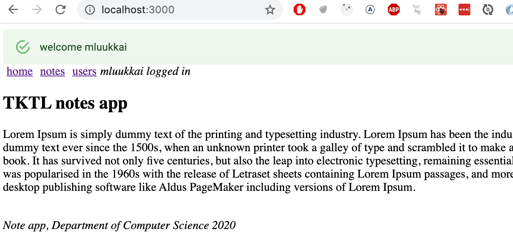
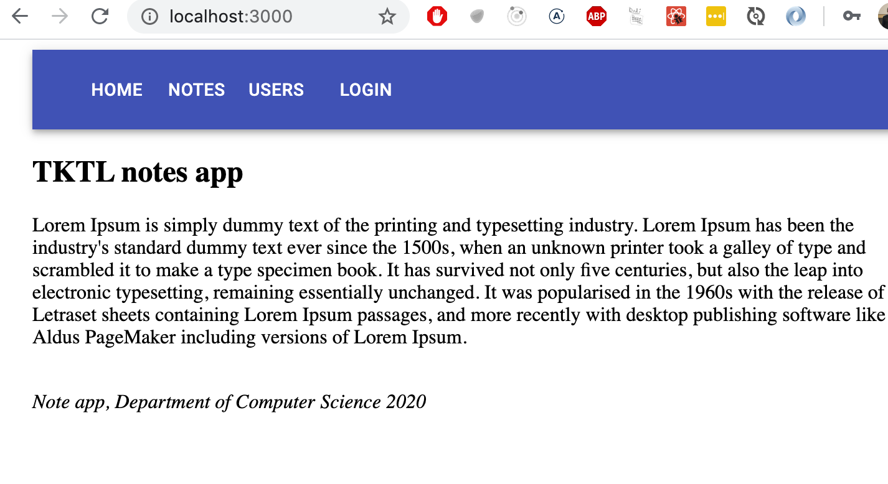
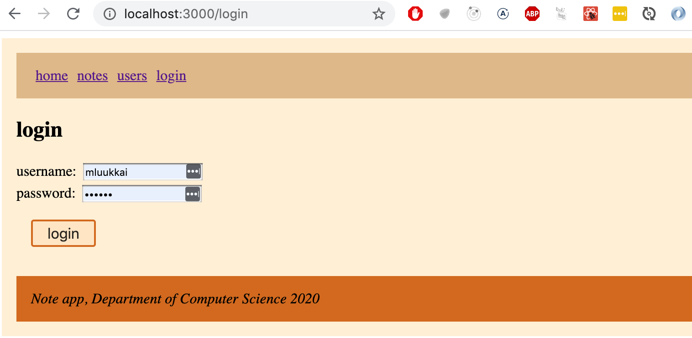

<div class="content">

Dans la partie 2, nous avons examiné deux manières différentes d'ajouter des styles à notre application: le vieux fichier [CSS unique](/fr/endocrinology/styliser_vos_applications_react) et les [styles inline](/fr/endocrinology/styliser_vos_applications_react#styles-en-ligne). Dans cette partie, nous allons examiner quelques autres méthodes.

### Bibliothèques UI prêtes à l'emploi

Une approche pour définir les styles d'une application consiste à utiliser un "framework UI" prêt à l'emploi.

L'un des premiers frameworks UI largement populaires était la boîte à outils [Bootstrap](https://getbootstrap.com/) créée par Twitter, qui peut encore être le framework le plus populaire. Récemment, il y a eu une explosion dans le nombre de nouveaux frameworks UI qui ont fait leur apparition sur la scène. La sélection est si vaste qu'il y a peu d'espoir de créer une liste exhaustive des options.

De nombreux frameworks UI fournissent aux développeurs d'applications web des thèmes prêts à l'emploi et des "composants" comme des boutons, des menus et des tables. Nous mettons des composants entre guillemets parce que, dans ce contexte, nous ne parlons pas de composants React. Généralement, les frameworks UI sont utilisés en incluant les feuilles de style CSS et le code JavaScript du framework dans l'application.

De nombreux frameworks UI ont des versions adaptées à React où les "composants" du framework ont été transformés en composants React. Il existe quelques versions React différentes de Bootstrap comme [reactstrap](http://reactstrap.github.io/) et [react-bootstrap](https://react-bootstrap.github.io/).

Ensuite, nous examinerons de plus près deux frameworks UI, Bootstrap et [MaterialUI](https://mui.com/). Nous utiliserons les deux frameworks pour ajouter des styles similaires à l'application que nous avons réalisée dans la section [React Router](/en/MSK/react_router) du matériel de cours.

### React Bootstrap

Commençons par examiner Bootstrap avec l'aide du package [react-bootstrap](https://react-bootstrap.github.io/).

Installons le package avec la commande:

```bash
npm install react-bootstrap
```

Ensuite, ajoutons un [lien pour charger la feuille de style CSS](https://react-bootstrap.github.io/docs/getting-started/introduction#stylesheets) pour Bootstrap à l'intérieur de la balise <i>head</i> dans le fichier <i>public/index.html</i> de l'application:

```js
<head>
  <link
    rel="stylesheet"
    href="https://cdn.jsdelivr.net/npm/bootstrap@5.3.0/dist/css/bootstrap.min.css"
    integrity="sha384-9ndCyUaIbzAi2FUVXJi0CjmCapSmO7SnpJef0486qhLnuZ2cdeRhO02iuK6FUUVM"
    crossorigin="anonymous"
  />
  // ...
</head>
```

Lorsque nous rechargeons l'application, nous remarquons qu'elle a déjà l'air un peu plus stylée:


Dans Bootstrap, tout le contenu de l'application est généralement rendu à l'intérieur d'un [conteneur](https://getbootstrap.com/docs/4.1/layout/overview/#containers). En pratique, cela est accompli en donnant à l'élément div racine de l'application l'attribut de classe _container_:

```js
const App = () => {
  // ...

  return (
    <div className="container"> // highlight-line
      // ...
    </div>
  )
}
```

Nous remarquons que cela a déjà affecté l'apparence de l'application. Le contenu n'est plus aussi proche des bords du navigateur qu'il l'était auparavant:


#### Tables

Ensuite, apportons quelques modifications au composant <i>Notes</i> pour qu'il rende la liste des notes sous forme de [table](https://getbootstrap.com/docs/4.1/content/tables/). React Bootstrap fournit un composant [Table](https://react-bootstrap.github.io/docs/components/table/) intégré à cet effet, il n'est donc pas nécessaire de définir séparément les classes CSS.

```js
const Notes = ({ notes }) => (
  <div>
    <h2>Notes</h2>
    <Table striped> // highlight-line
      <tbody>
        {notes.map(note =>
          <tr key={note.id}>
            <td>
              <Link to={`/notes/${note.id}`}>
                {note.content}
              </Link>
            </td>
            <td>
              {note.user}
            </td>
          </tr>
        )}
      </tbody>
    </Table>
  </div>
)
```

L'apparence de l'application est assez élégante:


Notez que les composants React Bootstrap doivent être importés séparément de la bibliothèque comme montré ci-dessous :

```js
import { Table } from 'react-bootstrap'
```

#### Formulaires

Améliorons le formulaire dans la vue <i>Login</i> avec l'aide des [formulaires](https://getbootstrap.com/docs/4.1/components/forms/) Bootstrap.

React Bootstrap fournit des [composants](https://react-bootstrap.github.io/docs/forms/overview/) intégrés pour créer des formulaires (bien que la documentation à leur sujet soit légèrement insuffisante):

```js
let Login = (props) => {
  // ...
  return (
    <div>
      <h2>login</h2>
      <Form onSubmit={onSubmit}>
        <Form.Group>
          <Form.Label>username:</Form.Label>
          <Form.Control
            type="text"
            name="username"
          />
        </Form.Group>
        <Form.Group>
          <Form.Label>password:</Form.Label>
          <Form.Control
            type="password"
          />
        </Form.Group>
        <Button variant="primary" type="submit">
          login
        </Button>
      </Form>
    </div>
  )
}
```

Le nombre de composants que nous devons importer augmente:

```js
import { Table, Form, Button } from 'react-bootstrap'
```

Après être passés au formulaire Bootstrap, notre application améliorée ressemble à ceci:


#### Notification

Maintenant que le formulaire de connexion est en meilleure forme, examinons comment améliorer les notifications de notre application:


Ajoutons un message pour la notification lorsqu'un utilisateur se connecte à l'application. Nous le stockerons dans la variable _message_ dans l'état du composant <i>App</i>:

```js
const App = () => {
  const [notes, setNotes] = useState([
    // ...
  ])

  const [user, setUser] = useState(null)
  const [message, setMessage] = useState(null) // highlight-line

  const login = (user) => {
    setUser(user)
    // highlight-start
    setMessage(`welcome ${user}`)
    setTimeout(() => {
      setMessage(null)
    }, 10000)
    // highlight-end
  }
  // ...
}
```

Nous allons rendre le message sous forme de composant [Alert](https://getbootstrap.com/docs/4.1/components/alerts/) Bootstrap. Encore une fois, la bibliothèque React Bootstrap nous fournit un [composant React](https://react-bootstrap.github.io/docs/components/alerts/) correspondant:

```js
<div className="container">
// highlight-start
  {(message &&
    <Alert variant="success">
      {message}
    </Alert>
  )}
// highlight-end
  // ...
</div>
```

#### Structure de navigation

Enfin, modifions le menu de navigation de l'application pour utiliser le composant [Navbar](https://getbootstrap.com/docs/4.1/components/navbar/) de Bootstrap. La bibliothèque React Bootstrap nous fournit des [composants intégrés correspondants](https://react-bootstrap.github.io/docs/components/navbar/#responsive-behaviors). À force d'essais et d'erreurs, nous arrivons à une solution fonctionnelle malgré la documentation énigmatique:

```js
<Navbar collapseOnSelect expand="lg" bg="dark" variant="dark">
  <Navbar.Toggle aria-controls="responsive-navbar-nav" />
  <Navbar.Collapse id="responsive-navbar-nav">
    <Nav className="me-auto">
      <Nav.Link href="#" as="span">
        <Link style={padding} to="/">home</Link>
      </Nav.Link>
      <Nav.Link href="#" as="span">
        <Link style={padding} to="/notes">notes</Link>
      </Nav.Link>
      <Nav.Link href="#" as="span">
        <Link style={padding} to="/users">users</Link>
      </Nav.Link>
      <Nav.Link href="#" as="span">
        {user
          ? <em style={padding}>{user} logged in</em>
          : <Link style={padding} to="/login">login</Link>
        }
      </Nav.Link>
    </Nav>
  </Navbar.Collapse>
</Navbar>
```

La mise en page résultante a une apparence très propre et agréable:


Si le viewport du navigateur est réduit, nous remarquons que le menu "se replie" et il peut être déployé en cliquant sur le bouton "hamburger":


Bootstrap et une grande majorité des frameworks UI existants produisent des conceptions [réactives](https://en.wikipedia.org/wiki/Responsive_web_design), signifiant que les applications résultantes se rendent bien sur une variété de tailles d'écran différentes.

Les outils de développement de Chrome permettent de simuler l'utilisation de notre application dans le navigateur de différents clients mobiles :


Vous pouvez trouver le code complet de l'application [ici](https://github.com/CliniQuick-hy2020/misc/blob/master/notes-bootstrap.js).

### Material UI

Comme deuxième exemple, nous examinerons la bibliothèque React [MaterialUI](https://mui.com/), qui implémente le langage visuel [Material Design](https://material.io/) développé par Google.

Installez la bibliothèque avec la commande

```bash
npm install @mui/material @emotion/react @emotion/styled
```

Maintenant, utilisons MaterialUI pour apporter les mêmes modifications au code que nous avons faites précédemment avec Bootstrap.

Rendez le contenu de toute l'application dans un [Container](https://mui.com/components/container/):

```js
import { Container } from '@mui/material'

const App = () => {
  // ...
  return (
    <Container>
      // ...
    </Container>
  )
}
```

#### Table

Commençons par le composant <i>Notes</i>. Nous allons rendre la liste des notes sous forme de [table](https://mui.com/material-ui/react-table/#simple-table):

```js
const Notes = ({ notes }) => (
  <div>
    <h2>Notes</h2>

    <TableContainer component={Paper}>
      <Table>
        <TableBody>
          {notes.map(note => (
            <TableRow key={note.id}>
              <TableCell>
                <Link to={`/notes/${note.id}`}>{note.content}</Link>
              </TableCell>
              <TableCell>
                {note.user}
              </TableCell>
            </TableRow>
          ))}
        </TableBody>
      </Table>
    </TableContainer>
  </div>
)
```

La table ressemble à cela:


Une caractéristique moins agréable de Material UI est que chaque composant doit être importé séparément. La liste des importations pour la page des notes est assez longue:

```js
import {
  Container,
  Table,
  TableBody,
  TableCell,
  TableContainer,
  TableRow,
  Paper,
} from '@mui/material'
```

#### Formulaire

Ensuite, améliorons le formulaire de connexion dans la vue <i>Login</i> en utilisant les composants [TextField](https://mui.com/material-ui/react-text-field/) et [Button](https://mui.com/material-ui/api/button/):

```js
const Login = (props) => {
  const navigate = useNavigate()

  const onSubmit = (event) => {
    event.preventDefault()
    props.onLogin('mluukkai')
    navigate('/')
  }

  return (
    <div>
      <h2>login</h2>
      <form onSubmit={onSubmit}>
        <div>
          <TextField label="username" />
        </div>
        <div>
          <TextField label="password" type='password' />
        </div>
        <div>
          <Button variant="contained" color="primary" type="submit">
            login
          </Button>
        </div>
      </form>
    </div>
  )
}
```

Le résultat est:


MaterialUI, contrairement à Bootstrap, ne fournit pas de composant pour le formulaire lui-même. Le formulaire ici est un élément HTML [form](https://developer.mozilla.org/en-US/docs/Web/HTML/Element/form) ordinaire.

N'oubliez pas d'importer tous les composants utilisés dans le formulaire.

#### Notification

La notification affichée lors de la connexion peut être réalisée à l'aide du composant [Alert](https://mui.com/material-ui/react-alert/)  qui est assez similaire au composant équivalent de Bootstrap:

```js
<div>
// highlight-start
  {(message &&
    <Alert severity="success">
      {message}
    </Alert>
  )}
// highlight-end
</div>
```

L'alerte est assez stylée:



#### Structure de navigation

Nous pouvons implémenter la navigation en utilisant le composant [AppBar](https://mui.com/material-ui/react-app-bar/).

Si nous utilisons le code d'exemple de la documentation

```js
<AppBar position="static">
  <Toolbar>
    <IconButton edge="start" color="inherit" aria-label="menu">
    </IconButton>
    <Button color="inherit">
      <Link to="/">home</Link>
    </Button>
    <Button color="inherit">
      <Link to="/notes">notes</Link>
    </Button>
    <Button color="inherit">
      <Link to="/users">users</Link>
    </Button>  
    <Button color="inherit">
      {user
        ? <em>{user} logged in</em>
        : <Link to="/login">login</Link>
      }
    </Button>                
  </Toolbar>
</AppBar>
```

nous obtenons une navigation fonctionnelle, mais cela pourrait être mieux


Nous pouvons trouver une meilleure manière dans la [documentation](https://mui.com/material-ui/guides/composition/#routing-libraries). Nous pouvons utiliser les [props de composant](https://mui.com/material-ui/guides/composition/#component-prop) pour définir comment l'élément racine d'un composant MaterialUI est rendu.

En définissant

```js
<Button color="inherit" component={Link} to="/">
  home
</Button>
```

le composant _Button_ est rendu de sorte que son composant racine soit le _Link_ de react-router-dom, qui reçoit son chemin comme champ de prop _to_.

Le code pour la barre de navigation est le suivant:

```js
<AppBar position="static">
  <Toolbar>
    <Button color="inherit" component={Link} to="/">
      home
    </Button>
    <Button color="inherit" component={Link} to="/notes">
      notes
    </Button>
    <Button color="inherit" component={Link} to="/users">
      users
    </Button>   
    {user
      ? <em>{user} logged in</em>
      : <Button color="inherit" component={Link} to="/login">
          login
        </Button>
    }                              
  </Toolbar>
</AppBar>
```

et cela ressemble à ce que nous voulons:



Le code de l'application peut être trouvé [ici](https://github.com/CliniQuick-hy2020/misc/blob/master/notes-materialui.js).

### Réflexions finales

La différence entre react-bootstrap et MaterialUI n'est pas grande. C'est à vous de décider lequel vous trouvez le plus attrayant.
Je n'ai pas beaucoup utilisé MaterialUI, mais mes premières impressions sont positives. Sa documentation est un peu meilleure que celle de react-bootstrap.
Selon <https://www.npmtrends.com/> qui suit la popularité des différentes bibliothèques npm, MaterialUI a dépassé react-bootstrap en popularité à la fin de 2018 :


Dans les deux exemples précédents, nous avons utilisé les frameworks UI avec l'aide de bibliothèques d'intégration React.

Au lieu d'utiliser la bibliothèque [React Bootstrap](https://react-bootstrap.github.io/), nous aurions tout aussi bien pu utiliser Bootstrap directement en définissant des classes CSS pour les éléments HTML de notre application. Au lieu de définir la table avec le composant <i>Table</i>:

```js
<Table striped>
  // ...
</Table>
```

Nous aurions pu utiliser une <i>table</i> HTML régulière et ajouter la classe CSS requise:

```js
<table className="table striped">
  // ...
</table>
```

L'avantage d'utiliser la bibliothèque React Bootstrap n'est pas évident à partir de cet exemple.

En plus de rendre le code frontend plus compact et lisible, un autre avantage d'utiliser les bibliothèques de frameworks UI React est qu'elles incluent le JavaScript nécessaire pour faire fonctionner certains composants. Certains composants Bootstrap nécessitent quelques [dépendances JavaScript](https://getbootstrap.com/docs/4.1/getting-started/introduction/#js) désagréables que nous préférerions ne pas inclure dans nos applications React.

Certains inconvénients potentiels de l'utilisation de frameworks UI via des bibliothèques d'intégration au lieu de les utiliser "directement" sont que les bibliothèques d'intégration peuvent avoir des API instables et une documentation pauvre. La situation avec [Semantic UI React](https://react.semantic-ui.com) est beaucoup mieux que celle de nombreux autres frameworks UI, car il s'agit d'une bibliothèque d'intégration React officielle.

Il y a aussi la question de savoir si les bibliothèques de frameworks UI devraient être utilisées en premier lieu. C'est à chacun de se forger sa propre opinion, mais pour les personnes manquant de connaissances en CSS et en design web, elles sont des outils très utiles.

### Autres frameworks UI

Voici quelques autres frameworks UI pour votre considération. Si vous ne voyez pas votre framework UI préféré dans la liste, veuillez faire une demande de modification (pull request) au matériel du cours.

<https://bulma.io/>
<https://ant.design/>
<https://get.foundation/>
<https://chakra-ui.com/>
<https://tailwindcss.com/>
<https://semantic-ui.com/>
<https://mantine.dev/>
<https://react.fluentui.dev/>
<https://storybook.js.org>
<https://www.primefaces.org/primereact/>
<https://v2.grommet.io>
<https://blueprintjs.com>
<https://evergreen.segment.com>
<https://www.radix-ui.com/>
<https://react-spectrum.adobe.com/react-aria/index.html>
<https://master.co/>
<https://www.radix-ui.com/>
<https://nextui.org/>
<https://daisyui.com/>
<https://ui.shadcn.com/>
<https://www.tremor.so/>
<https://headlessui.com/>

### Composants stylisés

Il existe également [d'autres manières](https://blog.bitsrc.io/5-ways-to-style-react-components-in-2019-30f1ccc2b5b) de styliser les applications React que nous n'avons pas encore examinées.

La bibliothèque [styled components](https://www.styled-components.com/) propose une approche intéressante pour définir des styles en utilisant des [littéraux de template étiquetés](https://developer.mozilla.org/en-US/docs/Web/JavaScript/Reference/Template_literals#tagged_templates), introduits dans ES6.

Faisons quelques changements aux styles de notre application avec l'aide de styled components. Tout d'abord, installez le paquet avec la commande:

```bash
npm install styled-components
```

Ensuite, définissons deux composants avec des styles:

```js
import styled from 'styled-components'

const Button = styled.button`
  background: Bisque;
  font-size: 1em;
  margin: 1em;
  padding: 0.25em 1em;
  border: 2px solid Chocolate;
  border-radius: 3px;
`

const Input = styled.input`
  margin: 0.25em;
`
```

Le code ci-dessus crée des versions stylisées des éléments HTML <i>button</i> et <i>input</i>, puis les assigne aux variables <i>Button</i> et <i>Input</i>.

La syntaxe pour définir les styles est assez intéressante, car les règles CSS sont définies à l'intérieur des accents graves (backticks).

Les composants stylisés que nous avons définis fonctionnent exactement comme les éléments <i>button</i> et <i>input</i> habituels, et ils peuvent être utilisés de la même manière:

```js
const Login = (props) => {
  // ...
  return (
    <div>
      <h2>login</h2>
      <form onSubmit={onSubmit}>
        <div>
          username:
          <Input /> // highlight-line
        </div>
        <div>
          password:
          <Input type='password' /> // highlight-line
        </div>
        <Button type="submit" primary=''>login</Button> // highlight-line
      </form>
    </div>
  )
}
```

Créons quelques composants supplémentaires pour styliser cette application, qui seront des versions stylisées d'éléments <i>div</i>:

```js
const Page = styled.div`
  padding: 1em;
  background: papayawhip;
`

const Navigation = styled.div`
  background: BurlyWood;
  padding: 1em;
`

const Footer = styled.div`
  background: Chocolate;
  padding: 1em;
  margin-top: 1em;
`
```

Utilisons les composants dans notre application:

```js
const App = () => {
  // ...

  return (
     <Page> // highlight-line
      <Navigation> // highlight-line
        <Link style={padding} to="/">home</Link>
        <Link style={padding} to="/notes">notes</Link>
        <Link style={padding} to="/users">users</Link>
        {user
          ? <em>{user} logged in</em>
          : <Link style={padding} to="/login">login</Link>
        }
      </Navigation> // highlight-line
      
      <Routes>
        <Route path="/notes/:id" element={<Note note={note} />} />  
        <Route path="/notes" element={<Notes notes={notes} />} />   
        <Route path="/users" element={user ? <Users /> : <Navigate replace to="/login" />} />
        <Route path="/login" element={<Login onLogin={login} />} />
        <Route path="/" element={<Home />} />      
      </Routes>

      <Footer> // highlight-line
        <em>Note app, Department of Computer Science 2022</em>
      </Footer> // highlight-line
    </Page> // highlight-line
  )
}
```

L'apparence de l'application résultante est illustrée ci-dessous:



Les composants stylisés ont connu une croissance constante en popularité récemment, et un assez grand nombre de personnes les considèrent comme la meilleure manière de définir des styles dans les applications React.

</div>

<div class="tasks">

### Exercices

Les exercices liés aux sujets présentés ici se trouvent à la fin de cette section du matériel de cours, dans l'ensemble d'exercices [pour étendre l'application de liste de blogs](/en/MSK/exercises_extending_the_bloglist).

</div>